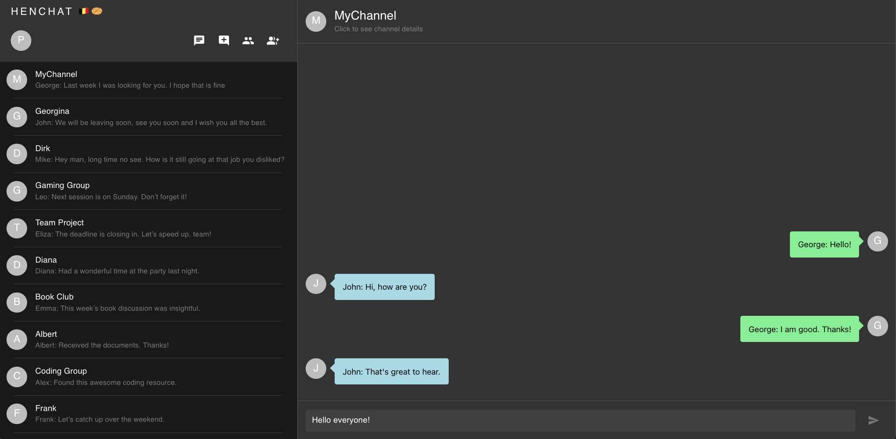

## Real-time chatting application

As a fun learning side project, I built this chat-app (proudly called henChat).

### Features
- Login with Jwt
- Real-time messaging
- Direct Messaging with contacts
- Public, private and password-protected channels
- Avatars and user profiles
- Blocking/Muting/Banning users from channels
- Admin and owner roles within channels
- Friendlist

### Tech-stack
- Front-end:
  - React /w Typescript
  - MaterialUI Components
- Back-end:
  - NestJS for HTTP Requests and Websockets (Socket.io)
  - PostgresSQL Database (/w Prisma ORM)
  - Docker running a dev-db and test-db
  - Jest for testing

### Demo

